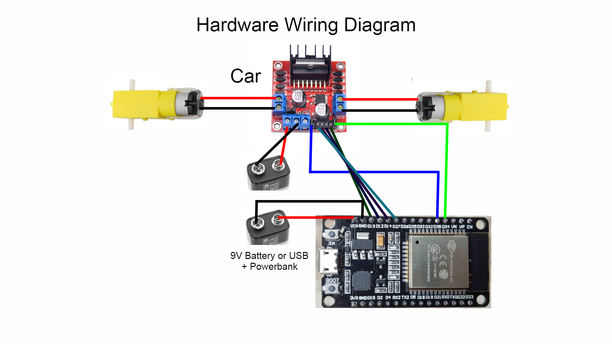
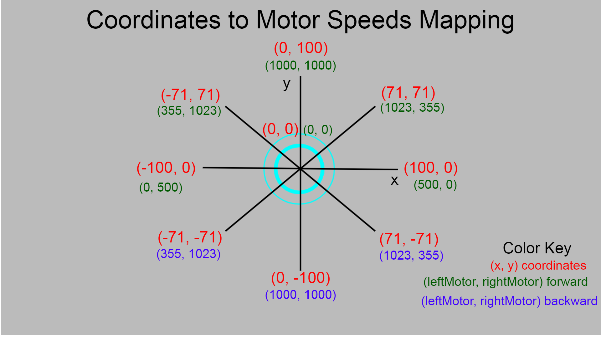
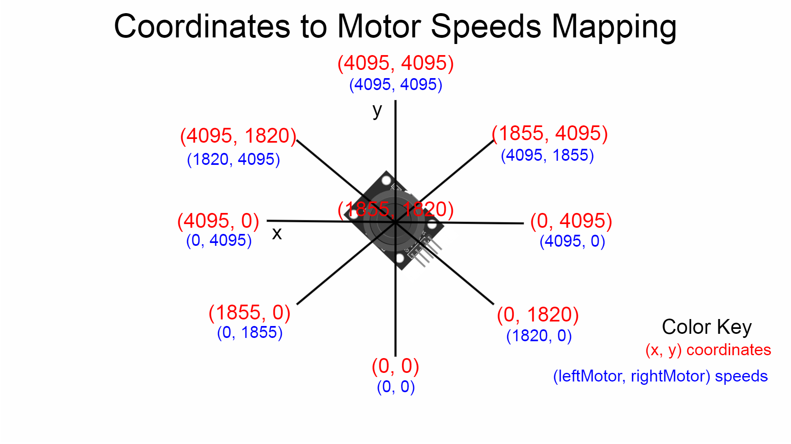

# ArduinoProjects

Collection of Arduino Uno, ESP32 projects.

## Projects Included:

### ESP32 WiFi Car

This project features a ESP32 that can remotely control a small car via a webserver that features a joystick. Because of the variable delay between HTTP request and responses, the car's motors may not always react quick enough and it is possible that it could get "stuck" on a previous joystick command. The hardware wiring and mapping for the joystick to the motor speeds is shown below. 



Given x and y the leftSpeed and rightSpeed are:

```
leftSpeed = constrain(abs(y*10) + (x*10)/2, 0, 1023);
rightSpeed = constrain(abs(y*10) - (x*10)/2, 0, 1023);
```
The direction (forward / backward) is simply determined by looking at the sign of y. A negative y means to move the wheels backward and a positive y means to move the wheels forward.



[Credits for joystick design](https://automatedhome.party/2017/07/15/wifi-controlled-car-with-a-self-hosted-htmljs-joystick-using-a-wemos-d1-miniesp8266/)

### ESP32-CAM SMTP Program

This project features a ESP32-CAM that can send a captured photograph by email to a desired recipient. At the time of testing, the pushbutton was intended to trigger the photograph capture and email, but there were issues with the pushbutton states not being recognized.

[Credits for program](https://randomnerdtutorials.com/esp32-cam-send-photos-email/)

### ESP32 Bluetooth Low Energy (BLE) Car

This project features an improvement on the ESP32 WiFi Car by using Bluetooth Low Energy to improve the response time between the joystick and the car. In addition, this project uses a client-server model where the car acts as the server to which the joystick module connects to as a client. The joystick mapping is also different than the WiFi Car in that the resting (center) state is no longer (0, 0). To resolve this, the project makes use of the switch button on the [joystick module](ESP32_BLE_Car/joystick.png) that allows us to toggle between forwards and backwards direction. The hardware wiring and mapping for the joystick to the motor speeds is shown below.


Given x and y the leftSpeed and rightSpeed are simply:

```
leftSpeed = y;
rightSpeed = x;
```




[BLE Example Code](https://github.com/CurtisIreland/electronics/tree/master/ESP32-RCBLE)

[BLE Example Code 2](https://github.com/CrazyRobMiles/SimpleESP32BluetoothBLE)

[BLE Example Code 3](https://github.com/nkolban/esp32-snippets/tree/master/cpp_utils/tests/BLETests/Arduino)

[BLE Example Code 4](https://github.com/Seeed-Studio/Seeed_Arduino_rpcBLE/tree/master/examples)